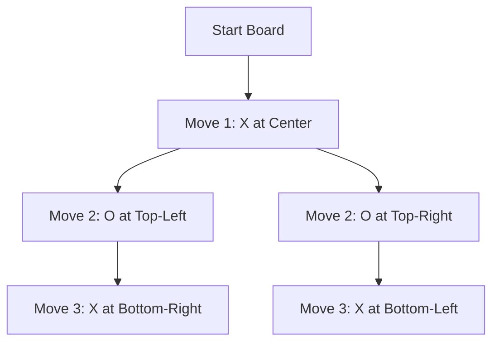

## 1. Introduction to Game Theory

**Overview:**  
Game theory is the study of mathematical models of strategic interaction among rational decision‐makers. It has applications in economics, political science, biology, and computer science.

- **Key Concepts:**
    
    - **Players:** Decision-makers (e.g., individuals, companies)
    - **Strategies:** The choices available to each player
    - **Payoffs:** The outcomes (or rewards/losses) resulting from each combination of strategies
    - **Zero-Sum Games:** A situation where one player’s gain is exactly the other’s loss. For example, in many competitive games (like chess or Tic Tac Toe), the sum of the outcomes is zero.
- **Applications:**  
    Understanding auctions, negotiations, and competitive markets.
    

---

## 2. John Nash and "A Beautiful Mind"

**John Nash’s Contribution:**  
John Nash introduced the concept of the _Nash equilibrium_, a solution concept where no player can benefit by unilaterally changing their strategy if the strategies of the others remain unchanged.

- **Nash Equilibrium:**
    - Each player’s strategy is optimal given the strategies chosen by the other players.
    - It provides a way of predicting what will happen if players are rational and have knowledge of each other’s strategies.

**Cultural Impact:**

- The film _A Beautiful Mind_ popularized Nash’s life and work, showing how his insights revolutionized our understanding of competitive and cooperative behavior in games.

---

## 3. The Prisoner’s Dilemma Experiment

**Scenario Explanation:**  
The classic prisoner’s dilemma involves two suspects arrested for a crime. Each has the option to either _cooperate_ with their partner (stay silent) or _defect_ (betray the other).

- **Outcome Matrix:**
 ![[Screenshot 2025-03-14 at 7.40.48 AM.png]]
    
- **Takeaway:**  
    Even though mutual cooperation yields a better overall outcome, rational self-interest may drive both players to defect, leading to a worse result for both—a paradox that has broad implications in economics and social science.
    

---

## 4. Two-Player Zero Sum Games

**Definition:**  
In a two-player zero sum game, one player’s win is exactly balanced by the other player’s loss.

- **Examples:**
    - Chess, Checkers, and Tic Tac Toe.

**Characteristics:**

- **Opposing Interests:** What benefits one player harms the other.
- **Optimal Strategies:** Often analyzed via minimax and equilibrium concepts.

---

## 5. Minimax Algorithm with Alpha–Beta Pruning

### 5.1 Minimax Overview

- **Objective:**  
    In a two-player zero-sum game, one player (the maximizer) wants to maximize the score, while the other (the minimizer) aims to minimize it.
    
- **How It Works:**
    
    - The game is represented as a tree of possible moves.
    - At each level of the tree, the algorithm chooses the best move assuming that the opponent also plays optimally.
    - The **evaluation function** scores terminal states (or non-terminal states when using a cutoff).

### 5.2 Maximizing vs. Minimizing Players

- **Maximizing Player:**  
    Chooses moves that maximize the evaluation function. In our Tic Tac Toe example, if the AI is the maximizer, it will pick moves that lead toward winning (score +1).
    
- **Minimizing Player:**  
    Chooses moves that minimize the evaluation function. For the human player (if the AI assumes optimal play), the moves are assumed to reduce the maximizer’s score (score −1).
    

### 5.3 Alpha–Beta Pruning

- **Purpose:**  
    It is an optimization to the minimax algorithm that prunes away branches that cannot possibly affect the final decision.
    
- **How It Works:**
    
    - **Alpha (α):** The best already explored option along the path to the maximizer.
    - **Beta (β):** The best already explored option along the path to the minimizer.
    - If at any point α ≥ β, further exploration down that branch can be stopped.

---

## 6. Tic Tac Toe Example with Mermaid Graphs

Tic Tac Toe is an ideal example because its complete game tree is small enough to illustrate the minimax approach. Below is a simplified Mermaid diagram that shows a fragment of the game tree:



**Explanation:**

- **Nodes:** Represent board states after moves.
- **Edges:** Represent a player’s move from one state to the next.
- The tree continues until terminal states (win, loss, or draw) are reached.

---

## 7. Java Implementation: Tic Tac Toe AI Using AWT

Below is the complete Java code that implements:

- A game board drawn with AWT (black grid on a light gray background).
- X is drawn in **red**, and O is drawn in **blue**.
- An Tic Tac Toe AI using minimax with alpha–beta pruning.
- An option (via a dialog) to let the computer or human go first.

```java
import java.awt.*;
import java.awt.event.*;
import javax.swing.JOptionPane;

public class TicTacToe extends Frame implements MouseListener {
    // Constants for board size and players
    private static final int SIZE = 3;
    private static final int CELL_SIZE = 100;
    private static final int BOARD_SIZE = CELL_SIZE * SIZE;
    private static final char EMPTY = ' ';
    private static final char X = 'X';
    private static final char O = 'O';

    private char[][] board;
    private boolean gameOver;
    private boolean humanTurn; // true if it's human's turn
    private char humanPlayer, aiPlayer;

    public TicTacToe() {
        board = new char[SIZE][SIZE];
        resetBoard();

        // Set up the Frame
        setTitle("Tic Tac Toe - Unbeatable AI");
        setSize(BOARD_SIZE + 20, BOARD_SIZE + 50);
        setBackground(Color.LIGHT_GRAY);
        setVisible(true);
        addMouseListener(this);

        // Ask who should go first
        int response = JOptionPane.showConfirmDialog(null, "Do you want to go first?", "Tic Tac Toe", JOptionPane.YES_NO_OPTION);
        humanTurn = (response == JOptionPane.YES_OPTION);
        // Assign players: human is X if going first, else O.
        humanPlayer = humanTurn ? X : O;
        aiPlayer = (humanPlayer == X) ? O : X;

        // If AI goes first, make the first move.
        if (!humanTurn) {
            aiMove();
        }
    }

    // Resets the board
    private void resetBoard() {
        for (int i = 0; i < SIZE; i++) {
            for (int j = 0; j < SIZE; j++) {
                board[i][j] = EMPTY;
            }
        }
        gameOver = false;
        repaint();
    }

    // Paint method draws the board and marks
    public void paint(Graphics g) {
        // Draw board grid: black lines
        g.setColor(Color.BLACK);
        for (int i = 1; i < SIZE; i++) {
            g.drawLine(i * CELL_SIZE, 0, i * CELL_SIZE, BOARD_SIZE);
            g.drawLine(0, i * CELL_SIZE, BOARD_SIZE, i * CELL_SIZE);
        }
        // Draw marks
        for (int i = 0; i < SIZE; i++) {
            for (int j = 0; j < SIZE; j++) {
                int x = j * CELL_SIZE;
                int y = i * CELL_SIZE;
                if (board[i][j] == X) {
                    g.setColor(Color.RED);
                    g.drawString("X", x + CELL_SIZE/2, y + CELL_SIZE/2);
                } else if (board[i][j] == O) {
                    g.setColor(Color.BLUE);
                    g.drawString("O", x + CELL_SIZE/2, y + CELL_SIZE/2);
                }
            }
        }
    }

    // Check for win condition or draw
    private int evaluate() {
        // Rows, columns, and diagonals
        for (int i = 0; i < SIZE; i++) {
            // Check rows
            if (board[i][0] != EMPTY && board[i][0] == board[i][1] && board[i][1] == board[i][2]) {
                return board[i][0] == aiPlayer ? +1 : -1;
            }
            // Check columns
            if (board[0][i] != EMPTY && board[0][i] == board[1][i] && board[1][i] == board[2][i]) {
                return board[0][i] == aiPlayer ? +1 : -1;
            }
        }
        // Diagonals
        if (board[0][0] != EMPTY && board[0][0] == board[1][1] && board[1][1] == board[2][2]) {
            return board[0][0] == aiPlayer ? +1 : -1;
        }
        if (board[0][2] != EMPTY && board[0][2] == board[1][1] && board[1][1] == board[2][0]) {
            return board[0][2] == aiPlayer ? +1 : -1;
        }
        return 0;
    }

    // Checks if moves remain
    private boolean movesLeft() {
        for (int i = 0; i < SIZE; i++) {
            for (int j = 0; j < SIZE; j++) {
                if (board[i][j] == EMPTY) return true;
            }
        }
        return false;
    }

    // Minimax algorithm with alpha-beta pruning
    private int minimax(int depth, boolean isMaximizing, int alpha, int beta) {
        int score = evaluate();

        // Terminal node (win/loss)
        if (score == 1 || score == -1) return score;
        if (!movesLeft()) return 0;

        if (isMaximizing) {
            int best = Integer.MIN_VALUE;
            for (int i = 0; i < SIZE; i++) {
                for (int j = 0; j < SIZE; j++) {
                    if (board[i][j] == EMPTY) {
                        board[i][j] = aiPlayer;
                        best = Math.max(best, minimax(depth + 1, false, alpha, beta));
                        board[i][j] = EMPTY;
                        alpha = Math.max(alpha, best);
                        if (beta <= alpha) break;  // Beta cutoff
                    }
                }
            }
            return best;
        } else {
            int best = Integer.MAX_VALUE;
            for (int i = 0; i < SIZE; i++) {
                for (int j = 0; j < SIZE; j++) {
                    if (board[i][j] == EMPTY) {
                        board[i][j] = humanPlayer;
                        best = Math.min(best, minimax(depth + 1, true, alpha, beta));
                        board[i][j] = EMPTY;
                        beta = Math.min(beta, best);
                        if (beta <= alpha) break;  // Alpha cutoff
                    }
                }
            }
            return best;
        }
    }

    // Determines the best move for the AI using minimax
    private int[] findBestMove() {
        int bestVal = Integer.MIN_VALUE;
        int[] bestMove = {-1, -1};
        for (int i = 0; i < SIZE; i++) {
            for (int j = 0; j < SIZE; j++) {
                if (board[i][j] == EMPTY) {
                    board[i][j] = aiPlayer;
                    int moveVal = minimax(0, false, Integer.MIN_VALUE, Integer.MAX_VALUE);
                    board[i][j] = EMPTY;
                    if (moveVal > bestVal) {
                        bestMove[0] = i;
                        bestMove[1] = j;
                        bestVal = moveVal;
                    }
                }
            }
        }
        return bestMove;
    }

    // AI move execution
    private void aiMove() {
        if (!gameOver && movesLeft()) {
            int[] move = findBestMove();
            if (move[0] != -1) {
                board[move[0]][move[1]] = aiPlayer;
                repaint();
                if (Math.abs(evaluate()) == 1 || !movesLeft()) {
                    gameOver = true;
                    String msg = (evaluate() == 1) ? "AI Wins!" : "Draw!";
                    showEndDialog(msg);
                }
                humanTurn = true;
            }
        }
    }

    // Check for win after human move
    private void checkGameOver() {
        int score = evaluate();
        if (score == -1) {
            gameOver = true;
            showEndDialog("You Win!");
        } else if (!movesLeft()) {
            gameOver = true;
            showEndDialog("Draw!");
        }
    }

    // Display game over dialog and offer to restart
    private void showEndDialog(String message) {
        int response = JOptionPane.showConfirmDialog(null, message + " Play again?", "Game Over", JOptionPane.YES_NO_OPTION);
        if (response == JOptionPane.YES_OPTION) {
            resetBoard();
            // Option to change who goes first on restart
            int res = JOptionPane.showConfirmDialog(null, "Do you want to go first?", "Tic Tac Toe", JOptionPane.YES_NO_OPTION);
            humanTurn = (res == JOptionPane.YES_OPTION);
            humanPlayer = humanTurn ? X : O;
            aiPlayer = (humanPlayer == X) ? O : X;
            if (!humanTurn) {
                aiMove();
            }
        } else {
            System.exit(0);
        }
    }

    // Handle mouse clicks for human moves
    @Override
    public void mouseClicked(MouseEvent e) {
        if (gameOver || !humanTurn) return;

        int col = e.getX() / CELL_SIZE;
        int row = e.getY() / CELL_SIZE;

        if (row < SIZE && col < SIZE && board[row][col] == EMPTY) {
            board[row][col] = humanPlayer;
            repaint();
            checkGameOver();
            humanTurn = false;
            if (!gameOver) {
                aiMove();
            }
        }
    }

    // Unused mouse events
    @Override public void mousePressed(MouseEvent e) { }
    @Override public void mouseReleased(MouseEvent e) { }
    @Override public void mouseEntered(MouseEvent e) { }
    @Override public void mouseExited(MouseEvent e) { }

    // Main method to start the game
    public static void main(String[] args) {
        new TicTacToe();
    }
}
```

**Code Explanation:**

- **Board Setup:**  
    A 3×3 char array represents the Tic Tac Toe board. Empty cells are marked with a space.
- **Painting the Board:**  
    The overridden `paint` method draws the grid (black lines) and the players’ marks: X in red and O in blue.
- **Game Logic:**  
    The `evaluate` method checks win conditions, while `movesLeft` checks for draws.
- **Minimax with Alpha–Beta Pruning:**  
    The `minimax` method recursively computes the best move for the AI, pruning branches that cannot affect the outcome.
- **User Interaction:**  
    Mouse clicks determine the human moves, and dialogs (via JOptionPane) allow players to choose who goes first and whether to restart after a game ends.

---
